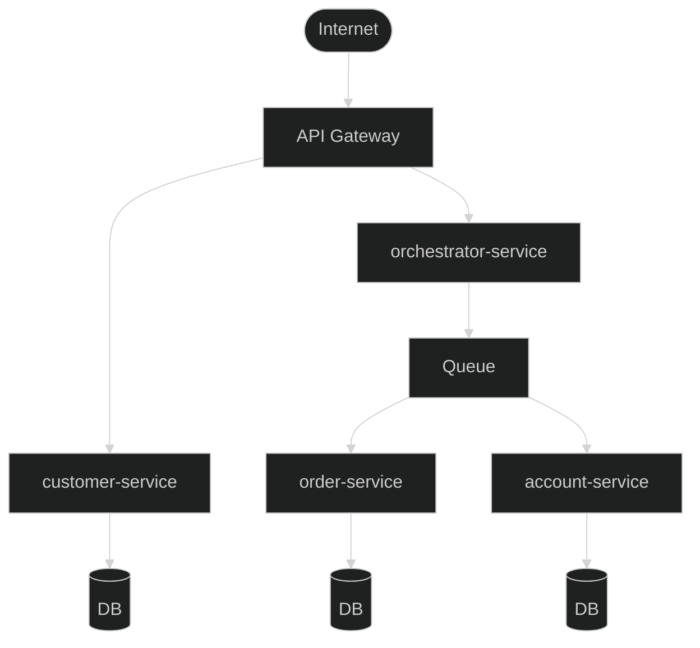

# microservices-backend

## 概要

マイクロサービスアーキテクチャのアプリケーションのバックエンド領域を管理するリポジトリ．

GitOpsの **[ベストプラクティス](https://blog.argoproj.io/5-gitops-best-practices-d95cb0cbe9ff)** に則って，マニフェストファイルは **[microservices-manifestsリポジトリ](https://github.com/hiroki-it/microservices-manifests)** で管理しています．

現状，フロント領域のリポジトリは用意しておりません．

## 使用技術

### 一覧

バックエンド領域を構成するマイクロサービスの一覧です．

| マイクロサービス名                                                                                         | 言語     | フレームワーク | プロキシコンテナ    | 境界付けられたコンテキストの説明  |
|---------------------------------------------------------------------------------------------------|--------|---------|-------------|-------------------|
| [accountサービス](https://github.com/hiroki-it/microservices-backend/tree/main/src/account)           | Go     | Gin     | Envoy       | 会計業務ドメインを解決します．   |
| [customerサービス](https://github.com/hiroki-it/microservices-backend/tree/main/src/customer)         | Python | FastAPI | Envoy       | 顧客管理業務ドメインを解決します． |
| [orchestratorサービス](https://github.com/hiroki-it/microservices-backend/tree/main/src/orchestrator) | Python | FastAPI | Envoy       | トランザクションの項目を参照．   |
| [orderサービス](https://github.com/hiroki-it/microservices-backend/tree/main/src/order)               | PHP    | Lumen   | Nginx，Envoy | 受注業務ドメインを解決します．   |

### マイクロサービス間通信の方式

リクエストリプライ方式を採用し，『API Gateway → マイクロサービスA ⇄ マイクロサービスB』という簡単な構成を想定しております．

### トランザクション

オーケストレーションベースのSagaパターンを採用する想定です．
[**orchestratorサービス**](https://github.com/hiroki-it/microservices-backend/tree/main/src/orchestrator) を用意し，これが各マイクロサービスの一連のローカルトランザクションを連続的に実行します．

### 開発ツール

開発環境でのみ使用するツールの一覧です．

| 役割         | ツール                            | 導入の状況          |
|------------|--------------------------------|----------------|
| メトリクスの可視化  | Prometheus，Kiali               | ⭕              |
| ログの可視化     | FluentBit，ElasticSearch，Kibana | coming soon... |
| 分散トレースの可視化 | Jaeger                    　　　  | ⭕              |
| ロードテスト     | Fortio                         | ⭕              |

### CI/CD

CI/CDを構成するツールの一覧です．

| 役割   | ツール      | 導入の状況          |
|------|----------|----------------|
| CI   | CircleCI | ⭕ |

 

## 環境構築

各マイクロサービスのREADMEをご参照ください．

## 参考

マイクロサービスアーキテクチャ：
 https://hiroki-it.github.io/tech-notebook-mkdocs/software/software_application_architecture_backend_microservices.html

境界づけられたコンテキスト：
 https://hiroki-it.github.io/tech-notebook-mkdocs/software/software_application_architecture_backend_domain_driven_design.html
